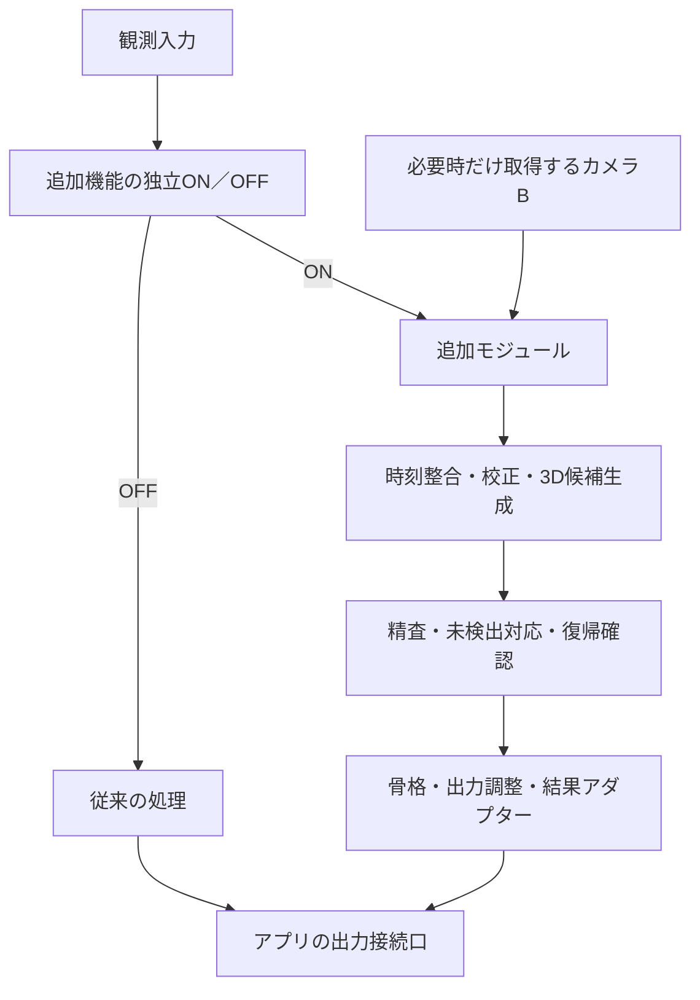
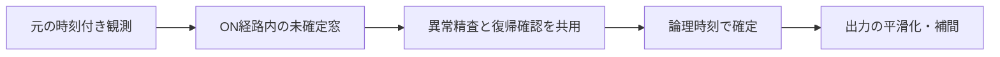

# 2カメラ・マーカーレス追跡 追加機能設計書

既存Python GUIへの追加設計 / 独立ON／OFF・身体と手のステレオ統合

版：1.1　改訂日：2026-08-31　対象：Claude Codeおよび実装・保守担当者

## 1. 実装方針と対象範囲

**本書は、既存アプリに切替可能な「2カメラ・マーカーレス追跡」を追加する仕様書である。既存機能の改変・置換・再設計を依頼するものではない。既存機能の延長として、利用可能な処理を流用しながら追加機能を実装する。**

**最重要要件：追加機能には既存機能とは独立したON／OFFを設ける。OFF時は追加処理を通らず、従来のアプリとして動作すること。既存機能は本書での列挙の有無にかかわらず改変対象外とする。**

Claude Codeで、本書の対象機能を一度の実装作業で全て完成させる。段階導入や一部機能だけの納品は行わない。実装中の作業順序・テストは必要だが、残りの機能を別の導入段階へ先送りしない。

### 背景情報

対象はPython製GUIアプリである。NVIDIA AR SDKによる表情検出とVMC / iFacialMocap形式の送信、MediaPipeによる姿勢・手追跡と上半身／全身モード、調整可能な平滑化、少量の遅延を使うFPS補間、一定時間遅延させる異常精査があると共有されている。この説明はアプリを理解するための例示であり、既存機能の網羅的な一覧でも、機能ごとの改修・維持対象リストでもない。

### 今回追加する機能

- 2台のカメラからの観測取得、時刻整合、同一関節の対応付け、三角測量。
- 印刷・表示マーカーを使わない、自然物の対応点クリックによる校正と検証。
- 身体・掌・指の観測統合、片側／両側未検出への対応、検出復帰時の暴れ抑制。
- 追加機能の独立ON／OFF、校正・品質表示・設定保存、記録再生と検証。

主な品質課題は検出復帰時の飛び・反転・異常速度である。「再検出された」ことと「出力へ採用できる」ことを分け、不確かな期間は単眼推定・予測・無効状態として扱う。

### 撮影条件と限界

Webカメラ2台を同じ高さ・光学中心間約30cm・光軸をほぼ平行にして固定する。HD・画角120°を想定し、数値試算には1280×720、水平画角120°、透視投影を用いる。実際の解像度、水平／対角画角、レンズモデル、FPSは実機で確認する。身体へのマーカー装着も要求しない。

対象は1人とする。ソースコードと実機は未確認であり、本書は実装・実測済みの報告ではない。絶対距離・指関節の高精度計測や遮蔽中の真の動きは保証しない。図やモジュール名は追加機能の設計例であり、既存構成をその形へ作り替える指示ではない。

## 2. 切替可能な追加機能の構造

### 接続境界

追加機能を独立したモジュールに置き、入力の受取りと結果の返却を小さなアダプターで接続する。既存の接続口・処理を利用できる部分は流用する。接続のために変更が必要な場合も、フック・分岐・追加設定等の最小範囲に限定する。接続作業を理由とした周辺機能の整理、置換、広範なリファクタリングは対象に含めない。



ON側の精査・平滑化・補間では利用可能なロジックを流用する。図は責務を示すものであり、同じ処理を二重に通したり、全てを新規実装したりする指示ではない。

### 独立ON／OFFの必須動作

- 追加機能専用のスイッチを設ける。初期値・設定未保存時はOFFとし、従来のスイッチやスライダーの意味を変えない。
- OFFでは追加結果の重みをゼロにするだけでなく、追加経路を迂回する。追加専用のカメラ取得・推論・ワーカーは起動しない。共有資源のうち他の機能が使用中のものは停止しない。
- ONでは校正と必要な資源を確認してから結果を採用する。初期化失敗や追加依存の欠落がアプリ全体の起動・従来動作を妨げないよう、追加側を必要時に初期化する。
- 追加設定、候補履歴、速度、共分散等を隔離する。ロジックを流用しても、追加側から従来の可変状態・設定を書き換えない。
- 実行中の切替には世代IDを付ける。OFF後に届く旧世代の結果を棄却し、追加資源を安全に解放する。出力元を一貫して切り替え、二重適用を防ぐ。

OFFへ戻す接続は現在の観測に基づき行い、休止中の古い履歴や追加経路の速度を持ち込まない。初期OFFでの起動とON→OFFの両方を試験する。初期値OFFは安全な利用設定であり、実装を部分納品するという意味ではない。

## 3. 理論：視差と奥行き

### 三角測量に必要な情報

カメラ間隔Bと、両カメラから同じ物理点を見る方向から3D位置を求める。見る方向は、画像上の座標と内部パラメータ・歪み補正から計算する。対象までの距離を事前入力する必要はない。[S1]

一般配置では、補正済み対応点と投影行列P1・P2を使って三角測量する。OpenCVのtriangulatePointsは同次座標を返すため、wで除算し、両カメラで正の深度かを確認する。入力点の座標系と投影行列の組み合わせを一致させる。

平行化して主点を揃えた理想条件では、次の関係になる。[S2]

```text
f = 画像幅 / (2 × tan(水平画角 / 2))
d = u左 - u右
Z = f × B / d
奥行き誤差の一次近似：σZ ≈ Z² / (f × B) × σd
```

1280px幅・水平120°ならf ≈ 369.5px、B = 0.30mなのでZ ≈ 110.85 / d [m]となる。下表の誤差は左右の差である視差に2pxの誤差がある場合の概算で、MediaPipeの実測精度ではない。

| 距離Z | 視差d | 奥行き誤差 | 幅10cmの像 |
|---|---:|---:|---:|
| 0.5m | 221.7px | 約0.45cm | 約74px |
| 1.0m | 110.9px | 約1.80cm | 約37px |
| 1.5m | 73.9px | 約4.06cm | 約25px |
| 2.0m | 55.4px | 約7.22cm | 約18px |
| 3.0m | 37.0px | 約16.24cm | 約12px |

同期・校正・遮蔽・対応間違いによる誤差は含まない。左右各カメラの誤差と、視差の誤差を混同しない。独立な左右誤差なら視差分散は両者の分散の和となる。小さい視差を微小定数に置き換えて巨大な距離を生成せず、不良観測として扱う。

120°が対角画角なら、この理想モデルでf ≈ 423.9pxとなる。魚眼や歪んだ出力には上の画角換算をそのまま適用しない。[S3] 広角HDでは指に割り当たる画素が少ないため、手首・手のひらの位置と指形状は別々に品質評価する。拡大やFPS補間は、元画像の情報量を増やさない。

## 4. マーカーレスの初期設定と校正

### 設置と手動対応点

2台は同じ高さ・約30cm間隔・同じ向きで剛性のある台に固定する。同一点を向く内向き配置は必須ではない。位置を変えずに向きだけ変えても、対象への2本の視線の交差角は変わらない。平行でも実際の微小な姿勢差は校正で扱う。

1. 実際に使用する解像度、クロップ、ズーム、フォーカス、歪み補正設定を固定する。
2. 両画像を静止画として表示し、机・棚・家具などの同じ物理的な角を左右でクリックする。
3. 初期目安として20〜30組を、画像の上下左右と手前・中間・奥へ分散させる。クリック拡大・番号・取消・周辺コーナー補正を用意する。
4. 対応間違いをロバスト推定で除外し、計算に使わない点でも整合を確認する。単一平面・一直線・狭い範囲への集中は避ける。
5. 推定結果、残差、前提、カメラ識別子、撮影設定、クリック元画像をプロファイルとして保存する。

### クリックで分かること、別途必要なこと

対応点のみから基本行列Fと画像の平行化は求められるが、一般に内部パラメータや実寸の3D形状がすべて確定するわけではない。未校正の復元には尺度だけでなく形状の曖昧さも残る。[S1][S4]

**今回の実用上の入口は、画角から内部パラメータの初期値を作り、クリックで相対姿勢を推定し、実測した基線長で尺度を与える「近似校正」である。** 画角の公称値、主点、歪みを仮定する限り、精度は実測で確認する。ほぼ平行な2固定視点の対応点を増やすだけで、焦点距離まで必ず正確に自己校正できるとは扱わない。

実装例は、各カメラの対応点をundistortPointsで正規化し、findEssentialMatのロバスト推定とrecoverPoseで相対回転R・並進方向tを求め、tの長さを実測基線Bに設定する流れとなる。十分な視差・点配置・正の深度の支持が得られない推定は保存せず、再選点を促す。[S1]

- 校正済みの内部パラメータが取得できる場合は、その撮影モードに一致する値を使う。
- 120°の映像で歪みが強い場合は、通常モデル／魚眼モデルを選定する。必要なら既存の直線の直線性や、自然物の既知の3D寸法・配置を追加の制約とする。これらにも十分な条件と検証が必要で、対応クリックだけの問題とは分ける。[S3][S4]
- 単一モニターの四隅を使う平面合わせや、基線長だけの入力を「完全校正」と表示しない。
- 校正の有効範囲を、実際に使う距離・画面領域で検証する。カメラ移動や撮影設定変更時はプロファイルを無効化する。

GUIには「未設定」「近似校正」「検証済み」を分けて表示する。「検証済み」は記録した試験範囲の意味であり、あらゆる距離の精度保証ではない。印刷物はどの手順にも要求しない。

## 5. 映像取得・時刻整合・処理負荷

### 撮影時刻と解析完了時刻を分ける

カメラごとに取得処理、フレーム番号、単調増加時刻、推論結果キューを持つ。MediaPipeの動画追跡インスタンスはカメラ別に独立させる。同じインスタンスに左右画像を交互入力しない。LIVE_STREAMは処理中の入力をスキップするため、コールバック到着順や最新結果同士でペアを作らない。[S5][S6]

時刻は可能ならデバイス由来の撮影時刻を共通時計へ変換する。取得直後のperf_counter_ns等しか得られない場合は「受信時刻による推定」と明記し、露光・USB・デコード・バッファの遅れが残る前提にする。固定オフセットと時計のドリフトも記録する。

OpenCVのgrabを両カメラで先に実行し、後からretrieveする方法は、デコード処理による取得差を小さくする助けになるが、露光のハードウェア同期ではない。[S7]

### ペアリング方針

- 元画像の時刻が近い左右結果を、有限長の時刻付きキューから選ぶ。許容差を超えるペアは三角測量に使わない。
- 片側の過去座標と他方の最新座標を、そのまま同時観測として扱わない。
- 追加側の未確定窓に両側の前後の有効観測があれば、共通時刻へ補間する方式を追加評価できる。ただし補間点は推定観測とし、共分散を増やす。欠落・ID変更・復帰境界を跨いで補間しない。
- 30fpsの独立カメラでは、位相差だけで最近傍フレームが約16.7msずれる場合がある。数msの許容差を設定しても、装置がその同期精度を満たす保証にはならない。

水平移動が主な場合の時刻ずれによる奥行き偏差は、おおよそ次式で見積もれる。

```text
|ΔZ| ≈ Z × |横方向速度| × |時刻差| / B
例：Z=2m、速度=1m/s、時刻差=10ms、B=0.30m → 約6.7cm
```

この式は小さいずれの理想化した近似である。速い手ほど許容時刻差を厳しくし、揃わない場合は単眼推定へ落とす。出力FPSを上げても撮影時刻差は解消しない。

### バックプレッシャー

未処理フレームを無制限に蓄積しない。推論投入は各系統で最新優先の有界キュー、精査用には別の有限時間リングバッファを使う。遅れた結果は履歴と時刻を確認して採否を決め、すでに送信した時刻へ巻き戻さない。GUIと顔処理を身体側の待機でブロックしない。

## 6. 内部データ契約と座標系

追加モジュール内のデータに観測品質・時刻・復帰状態を持たせる。接続先の形式は結果アダプターで吸収する。単眼／ステレオの差を後段で暗黙に解釈させない。

| レコード | 主なフィールド |
|---|---|
| FrameObservation | camera_id、frame_id、source_time、timestamp_quality、image_size、preprocess_transform、calibration_id |
| LandmarkObservation | person_id、hand_id、joint_id、uv_px、visibility等の有効な品質値、source_frame_id |
| FusionCandidate | observation_time、source_mask、position_m、covariance、pair_skew_ms、幾何残差、棄却理由 |
| TrackState | position、velocity、covariance、state、last_stereo_time、candidate_history、generation_id |
| CommittedPose | logical_time、generation_id、root、local_rotations、状態・品質・補正中フラグ |

品質値がAPIから得られない場合は欠損として保持し、便宜上1.0を入れない。Handsの左右分類スコアは各関節の位置精度を表す値ではない。Poseのvisibility等も、校正誤差や3D位置誤差の保証値にはしない。[S5][S6]

### 座標を混ぜない

1. MediaPipeの正規化x・yを、実際に検出へ渡した画像の画素座標へ戻す。
2. クロップ・リサイズ・回転・ミラーを逆変換し、校正に使ったカメラ画像座標へ戻す。
3. 適切なレンズモデルで点を補正する。正規化点にKを含む投影行列を使う等、二重適用をしない。
4. 三角測量後の座標を1つの共通座標系Wへ変換する。Wは例えば左カメラ基準とし、単位・軸・変換行列を明示する。
5. 最後に既存リターゲット・送信アダプターの座標系へ変換する。

平行化後の投影行列を使う場合、得られる座標は左カメラの平行化後の座標系になる。左の元カメラ座標と取り違えない。[S1]

MediaPipeのworld_landmarksは、Poseでは腰中心、Handsでは手中心の局所的な推定である。共通座標Wの絶対位置へそのまま代入しない。形状の補助に使う場合も、尺度・向き・接続点の整合を別途取る。[S5][S6]

追加側のカメラ切替や検出復帰でWを変えない。接続先の座標・単位とは明示的な変換で結ぶ。追加のプレビューではミラー表示と解析座標を分離し、左右ラベルを画像の左右と混同しない。

## 7. 観測統合と片側未検出への対応

### 観測を採用する順序

対象ID、左右の手、時刻、校正プロファイルを確認してから、補正済み対応点を三角測量する。両カメラでの正の深度、再投影・エピポーラ残差、視差／視線交差角、予測との整合、骨格との整合を確認する。

再投影誤差が小さくても、誤った対応点が同じエピポーラ線上にあれば不良3Dが成立する。幾何残差だけで採用しない。手の対応は配列順に頼らず、身体の手首、手の位置・形状、履歴を使う。

同じ関節番号でも、左右のMediaPipeが厳密に同じ物理点を推定する保証はない。遮蔽された関節にも推定座標が出る場合があるため、「数値がある＝見えている」と判定しない。画像全体の密な視差マップは必須とせず、まず信頼できる関節点だけを三角測量する。

### 状態推定の責務

共通状態として位置・速度・共分散を持ち、ステレオ位置には距離依存の不確かさを与える。遠距離のZはX・Yより不確かなことが多いため、全軸同じ強さで更新しない。モデル起因の系統誤差も残るので、共分散を過小にしない。

利用可能な位置・速度の推定ロジックは流用し、追加側の可変状態を隔離する。必要な場合は小規模なカルマンフィルタ／EKFを追加する。これは観測統合と欠落予測のためであり、ユーザーが調整する見た目の平滑化とは責務を分ける。ただし両者の遅延を合算して計測する。

| 状態 | 更新方法 | 出力の意味 |
|---|---|---|
| STEREO | 妥当な左右観測で3D更新 | ステレオ観測あり |
| MONO | 見える方向で補正、奥行きは履歴・骨格で補助 | 単眼推定 |
| PREDICTED | 有限時間だけ予測、速度減衰 | 新規観測なし |
| RECOVERING | 候補を検証し段階的に反映 | 復帰の確認／補正中 |
| LOST | 予測を終了、部位ごとの無効処理 | 3D位置は未確定 |
| DISABLED | モードにより対象外 | 欠落扱いにしない |

### 片側でしか見えない場合

単眼の1点は視線の方向を拘束するが、その視線上の距離は決めない。簡易版は直前の奥行きを保持して見える側へ追従させる。発展版は2D再投影を観測式とするEKFで補正し、奥行き方向の不確かさを増やす。

肘がステレオで測れていれば、前腕長と手首の視線から手首の候補範囲を狭められる。ただし複数解や誤差が残る。初めから片側しか見えていない部位は、他の拘束がなければ絶対位置未確定とする。両側で見える部位の更新まで停止しない。

## 8. 最優先対策：検出復帰時の暴れ

**「再び検出された」ことと「通常追跡へ戻してよい」ことを分ける。復帰候補を未確定の別状態に置き、未検出前のフィルタへ初回観測を即投入しない。**

### 復帰手順

1. **候補化：** 復帰した元観測を専用履歴へ蓄積する。追加側の確定状態・表示状態・速度を直ちに上書きしない。
2. **同一性と品質確認：** 同じ手・関節、左右の時刻整合、骨格、複数回の軌跡の整合を確認する。静止を条件にはしない。
3. **状態の再接続：** 短い欠落なら履歴を継承する。長い欠落や大きい修正では、新しい観測履歴から位置・速度・共分散を再設定する。共分散をゼロにしない。
4. **出力の遷移：** 確認済みの状態へ出力を連続的に戻す。復帰の係数を追加経路で利用する平滑化／補間の拡張点へ渡し、別の低域フィルタを直列追加しない。
5. **通常化：** 一定期間の品質が続いたら通常更新へ戻す。1回の欠落だけで状態を往復させず、その観測だけを棄却・予測扱いにする。

### 3つの飛びを別々に防ぐ

**初回誤検出の飛び：** 例えば1.5mで保持中に一瞬だけ3mとなる観測は、後続の整合を見て採否を決める。誤検出を滑らかに取り込むことは対策にならない。One Euro Filter等の速度適応型平滑化も、不良入力の事前除去が必要である。[S8]

**速度履歴による飛び続け：** 保持位置から復帰位置への補正を、身体の実際の移動速度・加速度・ジェスチャー速度として計算しない。復帰位置と最後の表示位置の差を1フレーム時間で割らない。

**状態の往復によるガタつき：** 通常継続と復帰承認に別の条件を持たせる。復帰の方を慎重にし、短い単発欠落では通常状態を維持しつつ予測を使う。不良観測を採用してよいという意味ではない。

### 本当に移動した対象を拒否し続けない

古い位置との距離だけで復帰を永久に棄却しない。1.5mで見失い、復帰後に2m付近で左右・骨格・軌跡が連続して整合するなら、別候補として再初期化できるようにする。IDが不明、または修正が極端に大きい場合は、不自然に空間を横切らせるより、対象部位を無効化してから再表示する方針も持つ。

手は位置・掌の向き・指の関節角度を分けて復帰させる。骨長は固定し、四元数は符号を連続化して最短経路で補間する。復帰する手だけに適用し、影響のない他の部位をリセットしない。

## 9. 精査窓の流用と遅延設計

### 追加機能内の未確定窓

遅延させた観測を後続情報で精査する仕組みを流用し、追加側では左右の幾何整合と復帰候補の確認を同じ未確定窓で行う。窓内の未送信候補は修正できるが、送信済み時刻は書き換えない。適用は追加機能のON経路に限定し、OFF経路の処理順・窓長を変更しない。



復帰確認に100ms相当の後続観測が必要で、その窓内に収まるなら、別の100ms待機バッファを追加しない。確認に使える時間が不足する場合は候補の承認を待ち、その間は予測等で補う。必要な窓長は追加側の設定として扱い、アプリ全体の設定を暗黙に変更しない。

ロジックの共用と状態の共有を混同しない。必要に応じて同じ実装から追加側の独立インスタンスを作り、従来経路の履歴を汚染しない。既存の拡張点で安全に実現できる場合はそれを利用する。

### 時間の種類を明示する

- **観測時刻：** 元画像が表す時刻。不明なら推定品質を付ける。
- **解析完了時刻：** 結果が到着した時刻。三角測量の対応付けには使わない。
- **確定時刻：** 精査が終わり、後から変更しないと決めた論理時刻。
- **出力対象時刻：** 補間が評価する時刻。単調増加させる。
- **実送信時刻：** 送信した実時刻。元観測からの経過時間を計測する。

### 遅延の評価

```text
総遅延 ≈ 取得・デコード + 推論 + 共用精査窓
        + 補間の先読み分 + 平滑化による追従遅れ
```

並行・重複する処理もあるため実測で確認する。復帰の承認時間と、その後の出力補正時間は別の指標とする。遅着結果は未確定窓内だけに反映し、窓外は破棄・ログ化する。部位ごとのタイムアウトを設け、片手の復帰待ちで他の処理や出力時計を止めない。

## 10. 追加結果の出力と流用時の注意

### 平滑化・補間の適用

追加側の観測採否と復帰確認を終えてから、利用可能な平滑化・FPS補間へ接続する。接続先ですでに適用される処理を追加側でも重ねない。流用時の拡張は追加経路内に閉じ、通常の調整項目の意味を読み替えない。

合成した高FPSフレームを新しい測定として三角測量・復帰判定へ戻さない。補間で確信度を増やさず、観測由来・補間・外挿を内部で識別する。

補間は同じ対象ID・校正ID・モード世代の区間内に限定する。欠落・対象入替・機能切替の境界を跨ぐ高次補間は避ける。復帰境界は制限付き線形補間や単調な遷移、回転は四元数の符号を揃えた補間を使う。最終段で骨長・関節制約・正規化・有限値を確認する。

### 結果アダプターの責務

追加モジュールは、接続先が受け取る座標系・単位・骨格形式へ結果を変換して返す。ステレオ座標を直接送信しない。今回の対象である身体・手の結果だけを提供し、対象外の出力項目へ書き込まない。同じ項目へ複数の経路から同時に適用しないよう、追加側の出力選択を管理する。

外部のVMC / iFacialMocap送信形式やマッピングを追加機能の都合で拡張しない。信頼度・復帰状態等は追加側の内部データに保持する。接続時に名称・単位・四元数順序等の契約を確認する。[S9][S10]

部位の無効状態を直接表現できない接続先では、保持・ニュートラル姿勢への遷移等の成立する表現を追加側で選ぶ。パケット省略でその部位が消えるとは仮定せず、ゼロ座標・ゼロ四元数を無効値として渡さない。

## 11. 追加機能の技術選定

技術選定は追加モジュールに必要な範囲を対象とする。アプリ全体の構成・ライブラリ・GUIを選び直す作業は含めない。

| 追加領域 | 選定 | 用途・条件 |
|---|---|---|
| 実装言語・接続 | Python、薄いアダプター | 独立モジュールとして組み込む |
| 姿勢・手の観測 | 利用中のMediaPipe API | カメラごとに独立した推論状態 |
| 幾何計算 | OpenCV + NumPy | 点補正、対応検査、三角測量 |
| 状態推定 | 流用可能な推定処理、必要時はEKF | 不確かさ、単眼更新、有限時間予測 |
| 骨格・出力調整 | 利用可能な計算ロジックを流用 | 骨長・回転、平滑化・補間の重複回避 |
| 設定・ライフサイクル | 独立設定とON／OFF管理 | 状態・世代ID・追加資源を隔離 |
| 記録・再生 | 時刻付きイベントと配列 | 同じ入力で再現・比較する |

### ワーカーと資源

追加の取得・推論・統合はGUIのイベント処理をブロックしないワーカーで行う。カメラごとの推論状態は分け、フレーム共有は読み取り専用とする。同じカメラの重複オープンを避け、追加側だけの停止で共有資源を解放しない。

有界キューとバッファ所有権を明示する。プロセス分離は必要性を計測して判断し、大きな画像コピーや無制限の滞留を避ける。OFF時の終了待ち・SDK解放が相互待機しないよう、追加側の終了手順とタイムアウトを定義する。

### 実行方式と依存関係

MediaPipeのGPU利用可否は使用中のAPI・OS・配布パッケージで確認する。Pythonで任意のCUDA実行ができるとは仮定しない。追加負荷がアプリの他の処理を圧迫しないようCPU/GPU実行を実測し、必要資源を見積もる。[S5][S6]

追加依存は現行環境と互換な版を選び、動作する組合せを記録する。既存環境の一括更新を実装の前提にしない。追加側の任意依存・校正情報が利用不能でも、OFFでアプリが動く構造とする。

## 12. GUI設定とパラメータの初期値

「2カメラ追跡」の追加パネルに、独立ON／OFF、校正、追加パラメータをまとめる。初期値はOFFとする。追加設定を専用の名前空間へ保存し、既存設定を書き換えない。

### 追加する表示

- 追加機能のON／OFF、準備中・動作中・停止・エラーの状態。
- 観測に使うカメラA・Bの固定識別子と実際の解像度・FPS。
- 校正プロファイルと状態、水平／対角画角、レンズモデル、基線長。
- 左右の元観測、対応ID、補正後の整合線、棄却点とその理由。
- 部位状態、奥行きの不確かさ、最後のステレオ観測からの経過時間。
- 入力FPS、実推論FPS、有効ペアFPS、送信FPSを個別に表示する。
- 時刻差、推論待ち、共用精査窓、観測から送信までの遅延、追加側の処理負荷。

### 調整開始点

次の値は実測前の初期値であり、一律の合格条件ではない。フレーム数だけでなく実時間を使い、設定ごとの状態遷移をログに残す。

| 項目 | 初期案 | 調整上の注意 |
|---|---|---|
| 基線長 | 実測約0.30m | 本体端ではなく光学中心間 |
| 手動対応点 | 20〜30組 | 同一平面に集中させない |
| ペア時刻差 | まず5〜10msを評価 | 合格率と運動速度を見て決定 |
| 復帰確認 | 有効観測3〜5回 | 追加側の精査窓を共用、合成点は数えない |
| 両側欠落の予測 | 100〜200ms以内から評価 | 動作速度と信頼度で短縮可能 |
| 復帰出力の遷移 | 100〜200msから評価 | 流用する平滑化・補間との重複を避ける |
| 状態切替 | 継続より復帰を厳しく | 不良観測の許容と混同しない |
| 許容奥行き・速度 | 使用範囲から設定 | 全関節共通の固定値にしない |

ペアの許容時刻差を緩めるほど有効ペア数は増えるが、速い動きの奥行き偏差も増える。満たせない場合は警告と単眼フォールバックを使い、品質表示を「ステレオ成功」のままにしない。

### 上半身／全身モード

追加側は選択中のモードを入力として受け取り、上半身モードでは対象外の脚をDISABLEDとし、未検出カウントや全身のLOST判定に使わない。全身モードでは脚・足首の状態も独立管理する。床拘束は床面と接地が確認できる場合のみ使用する。

追加側はモード変更を検知したら世代IDを更新し、旧モードとの不適切な補間を禁止する。継続可能な他の部位まで一律初期化しない。継承する範囲は対象ID・座標系・時刻が連続していることを条件にする。

## 13. 想定トラブルと対策：取得・校正・幾何

各トラブルは「症状」と「観測すべきログ」を対応づける。スライダーを変更する前に、原因が取得・幾何・状態管理・表示のどこにあるかを切り分ける。

| 症状 | 主な原因・確認項目 | 対策 |
|---|---|---|
| 静止時は良いが動くとZが崩れる | 左右時刻差、露光差、ローリングシャッター | 元時刻ペアリング。照明・露光を確認。高速時は棄却 |
| 遠いほどZが暴れる | 小視差、関節位置の揺れ | 距離依存の共分散、視差判定、遠距離の単眼併用 |
| 画面端だけ位置がずれる | 歪み、クロップ変換、校正の偏り | レンズモデル・逆変換を確認。周辺を含む検証 |
| 全体の距離が一定比率で違う | 基線長、画角、焦点距離、単位 | 実測基線と撮影モードを確認。既知距離で尺度検証 |
| 中央でも形が歪む | 内部パラメータの近似、退化した対応点 | 近似校正の限界を明示。奥行きの異なる点で再検証 |
| 距離が負・無限大になる | 左右順、微小視差、誤対応 | 正の深度・交差角・有限値判定。クランプだけで隠さない |
| 手の左右が入れ替わる | 配列順への依存、ミラー、交差 | 身体の手首・軌跡・形状でID維持 |
| 時間とともに遅延が増える | キュー無制限、USB帯域、推論不足 | 有界キュー、古い投入の破棄、段階別FPS計測 |
| 再接続後だけ破綻する | カメラID入替、解像度・フォーカス変更 | 識別子と設定照合。校正を失効し新世代で開始 |

### カメラ設定と帯域

同じモデル・同じ撮影モードは調整を簡単にするが、同期や同じ内部パラメータを保証しない。自動露出・オートフォーカス・電子手ぶれ補正・自動フレーミングによる変化を確認する。SDKが公開していない設定を「固定できた」と扱わない。

2台を同一USB経路へ接続した場合、帯域・給電・デコード負荷でフレーム落ちや遅延が変わり得る。非圧縮／MJPEG等の選択は実機で比較し、画質、遅延、CPU負荷のトレードオフを記録する。送信FPSだけを見てカメラが安定していると判断しない。

## 14. 想定トラブルと対策：復帰・機能切替

| 症状 | 主な原因・確認項目 | 追加側での対策 |
|---|---|---|
| 復帰1フレーム目に跳ぶ | 初回候補の即採用、時刻の違う左右結果 | 候補を隔離し、共用精査窓で確認 |
| 復帰後も飛び続ける | 補正差から異常速度を生成 | 実動作と補正を分離、速度履歴を再設定 |
| 正しく見えても復帰しない | 古い位置への固定ゲート | 別候補の連続整合から再捕捉 |
| 検出・未検出でガタつく | 状態遷移の往復、信頼度の急変 | 復帰と継続で条件を分ける |
| 指が伸びる・裏返る | 点ごとの補間、回転符号、IK多解 | 骨長固定、回転補間、関節制約 |
| 遅延が増える | 精査窓・平滑化・復帰待機の重複 | 選択経路内で重複をなくす |
| アプリ全体が重くなる | 追加推論の競合、キュー滞留 | 追加資源・投入頻度を制限、待機を分離 |
| 同じ出力項目が震える | 複数経路による競合 | 追加結果の適用元を1つにする |
| OFFでも挙動が変わる | 新規履歴・設定・処理が残る | 完全な迂回、設定と状態の隔離 |
| OFF直後に値が戻る | 遅着コールバック、旧キュー | 世代IDで棄却、出力元を一貫して切替 |
| OFFで起動できない | 追加依存の無条件読込み | 追加側の遅延初期化、エラーの局所化 |
| 上半身で全体がLOSTになる | 対象外の脚を欠落判定 | 追加側でDISABLEDと欠落を区別 |

### 欠落と機能OFFを区別する

ON中の片側未検出は追加モジュール内のMONO等への移行であり、機能OFFとは異なる。単眼の局所world_landmarksをステレオの絶対位置に代入せず、共通座標上で補う。

校正無効・時刻不明・ID不明等では不良ステレオ更新を止め、GUIに理由を表示する。追加側が継続不能ならその機能だけを無効にし、2章の切替手順で従来経路へ戻る。エラー処理を理由に対象外の機能・設定を変更しない。

## 15. Claude Codeによる一括実装と検証

### 一度の実装で完成させる範囲

**Claude Codeは、本書で定義した追加機能を全て実装完了する。段階導入、部分納品、後の段階での機能追加を前提にしない。既存機能の改修依頼と解釈せず、独立ON／OFF可能な拡張実装として扱う。**

実装中の調査・コーディング・テストには順序があってよいが、完成物は、観測取得、クリック校正、時刻整合、身体・掌・指の統合、未検出・復帰制御、設定画面、切替と資源管理、結果接続、検証までを含む。状態推定等の代替手法は採用方式を決めて完成させ、未接続のスタブで終えない。

参照した既存機能は背景・流用元であり、別の改修対象を追加する根拠にはしない。接続に必要な最小変更と追加コードを区別して説明する。実機が利用できない項目は未検証と明記し、実装完了と精度・性能の実測確認を混同しない。

### 必須の試験シナリオ

- 静止、前後移動、高速な横移動、手の交差、指の開閉、画面端。
- 片側遮蔽、両側遮蔽、欠落の反復、長時間欠落、欠落中の実際の位置移動。
- 切断・再接続・カメラID順変更、撮影条件変更、上半身／全身切替、結果の遅着・逆順。
- OFF起動、ON→OFF→ON、初期化失敗、追加依存の欠落、旧世代コールバック到着。
- OFF時と変更前アプリの同一入力による比較。背景に列挙した機能だけに対象を限定せず、既存の回帰テストと接続境界への影響を確認する。

### 測る指標

ステレオ有効率、時刻差、3Dの揺れ・距離偏り、再投影誤差、骨長誤差、復帰の誤承認・未承認、承認時間、出力収束時間を測る。ジャンプ量と角速度のp95・最大値は、実際の高速動作と復帰補正を分けて記録する。

入力・推論・有効ペア・出力FPS、各処理の遅延、CPU/GPU使用量を比較する。OFF時に追加推論・専用資源・追加待機が残っていないことを確認する。滑らかでも動きが消える、または大きく遅れる場合は合格にしない。

精度の真値には自然物の既知寸法や実測した位置を利用でき、印刷マーカーは要求しない。これは試験用の情報であり、運用時に対象距離を入力させる仕様ではない。合格値は使用距離・許容誤差・許容遅延に基づいて設定する。

## 16. 接続前の確認と完了条件

### 実装時に確認する境界

観測を受け取る場所、流用可能な処理の呼出し方と履歴の所有者、結果を返す形式、設定保存先、資源の所有者を調べる。撮影条件と使用距離も確認する。この調査は追加機能の接続に必要な範囲で行い、アプリ全体の再設計へ拡張しない。

### 完了条件

1. 本書の対象機能が一括で実装され、未実装の段階・未接続の代替経路が残っていない。
2. 独立ON／OFFがあり、OFF起動・ON→OFFの両方で追加処理を迂回できる。
3. 既存機能を今回の改変対象にせず、列挙の有無にかかわらず従来動作への意図しない影響がない。
4. 接続以外の不要な変更がなく、追加設定・状態・資源が隔離されている。
5. 追加依存・校正・カメラの不具合がOFF時の起動や従来動作を妨げない。
6. 校正と撮影条件が紐づき、同じ時刻・対象・座標系の妥当な観測だけを三角測量する。
7. 片側／両側欠落、復帰候補、モード対象外、機能OFFを区別できる。
8. 復帰初回を即採用せず、補正差を実速度にせず、実際の別位置への復帰を拒否し続けない。
9. 精査・平滑化・補間が重複せず、切替時に古い結果や二重適用が発生しない。
10. 実施した試験、未検証項目、精度・遅延・使用範囲を明記して完了を報告する。

### 記録と禁止事項

通常は必要な数値・状態・棄却理由を記録し、映像保存は明示的なデバッグ操作に限定する。保存先・保持期間・削除方法を表示し、無断の外部送信をしない。

**禁止事項：** 既存機能の列挙を限定的な維持リストと解釈すること、追加を口実とした既存機能の置換・再設計、旧世代結果の適用、古い左右観測の混合、合成FPSの測定扱い、欠落のゼロ埋め、座標系の混在、復帰初回の即時上書き、補正差の速度化、未検証の近似校正を精密計測と表示すること。

## 付録A. 追加モジュールの責務と処理の骨子

名前は例であり、現行構造をこの一覧へ作り替える指示ではない。独立とはモジュール・設定・状態・切替の分離を意味し、別アプリや別プロセスを必須としない。

| 追加モジュール例 | 責務 |
|---|---|
| TrackingExtension | ON／OFF、初期化・停止、世代ID、追加資源の管理 |
| ObservationAdapter | 入力の受取り、時刻、共有フレームの読取り |
| CameraTracker | カメラ別のPose / Hands観測と状態 |
| CalibrationProfile | K・歪み・相対姿勢・撮影設定の管理 |
| ObservationAligner | 時刻と対象・手・関節の対応 |
| StereoCandidateBuilder | 点補正、三角測量、残差・不確かさ |
| ReviewAndFusion | 未確定窓、復帰確認、単眼更新・予測 |
| ResultAdapter | 骨格・出力形式への変換と追加結果の受け渡し |

```text
追加機能がOFFなら:
    追加側を初期化せず、従来処理を選択
    追加結果・追加履歴を適用しない

ON経路へ元観測が到着したら:
    有効世代・時刻・校正・対象を照合
    左右が揃えば3D候補、揃わなければ単眼候補
    未確定窓で異常・復帰候補を確認

ON経路の論理時刻を確定するとき:
    採用候補で状態を更新し、欠落・復帰を処理
    骨格・平滑化・補間を重複なく適用
    出力対象時刻の結果を接続先の形式へ変換

OFFへ切り替えるとき:
    世代を更新し、追加結果の採用を停止
    従来処理へ戻す接続を行い、追加資源を解放
```

擬似コードはアプリ本体の処理ループの置換ではなく、追加機能の動作契約を示す。フレーム所有権、キュー上限、ロック順、終了手順を追加側で定義し、OFF時と切替時の回帰試験を行う。

## 付録B. 技術根拠・参照資料

参照確認日：2026-08-31。公式仕様・著者公開資料を根拠として使用した。状態機械、追加モジュールの構成、閾値は本書の設計提案であり、ライブラリが自動提供する保証ではない。

- [S1 OpenCV：Camera Calibration and 3D Reconstruction](https://docs.opencv.org/4.x/d9/d0c/group__calib3d.html) — 基本行列、姿勢復元、点の補正、平行化、三角測量と座標系。
- [S2 OpenCV：Depth Map from Stereo Images](https://docs.opencv.org/4.x/dd/d53/tutorial_py_depthmap.html) — 基線長・焦点距離・視差・奥行きの関係。誤差と画素数の表は本書で計算した概算。
- [S3 OpenCV：Fisheye camera model](https://docs.opencv.org/4.x/db/d58/group__calib3d__fisheye.html) — 魚眼モデルと歪み補正。120°という画角だけではモデルは確定しない。
- [S4 Oxford：Camera Calibration and Reconstruction of Geometry from Images](https://www.robots.ox.ac.uk/~vgg/publications/2001/Liebowitz01/) — 自然物の直線・直交性、カメラの部分的知識等を用いる校正と制約。
- [S4補足 Oxford：Three-view and Multiple-view Geometry](https://www.robots.ox.ac.uk/~az/tutorials/tutorialb.pdf) — 対応点からの復元に残る射影的な曖昧さと、メトリック復元の区別。
- [S5 MediaPipe：Pose Landmarker for Python](https://developers.google.com/edge/mediapipe/solutions/vision/pose_landmarker/python) — 正規化座標、腰中心のworld座標、追跡、時刻、非同期入力のスキップ。
- [S6 MediaPipe：Hand Landmarker for Python](https://developers.google.com/edge/mediapipe/solutions/vision/hand_landmarker/python) — 手の局所world座標、左右分類、追跡失敗後の再検出、非同期実行。
- [S7 OpenCV：VideoCapture](https://docs.opencv.org/4.x/d8/dfe/classcv_1_1VideoCapture.html) — grab / retrieveと複数カメラ取得。露光同期とは区別する。
- [S8 Casiez・Roussel・Vogel：1 Euro Filter](https://gery.casiez.net/1euro/) — 動きの速度に応じた平滑化と、揺れ・遅延の調整。
- [S9 VMC Protocol specification](https://protocol.vmc.info/english.html) — root、骨、ブレンドシェイプ、OSC/UDP通信と互換性。
- [S10 iFacialMocap communication specifications](https://www.ifacialmocap.com/for-developer/) — 既存送信形式の互換性確認先。
- [S11 NVIDIA AR SDK Programming Guide](https://docs.nvidia.com/deeplearning/maxine/ar-sdk-programming-guide/index.html) — 表情、時間フィルタ、CUDAストリーム、モデルと座標系。
- [S11補足 NVIDIA AR SDK System Guide](https://docs.nvidia.com/deeplearning/maxine/ar-sdk-system-guide/index.html) — 実行環境、SDK・モデル・依存関係の確認先。
- [S12 OpenCV：KalmanFilter](https://docs.opencv.org/4.x/dd/d6a/classcv_1_1KalmanFilter.html) — 線形状態推定の参照。単眼の非線形再投影更新はEKF等として別途実装する。

公開資料のバージョンが現行アプリと異なる場合は、インストール済みAPIと付属資料を優先して差分を確認する。新しい版への更新は本導入とは分けて判断する。
